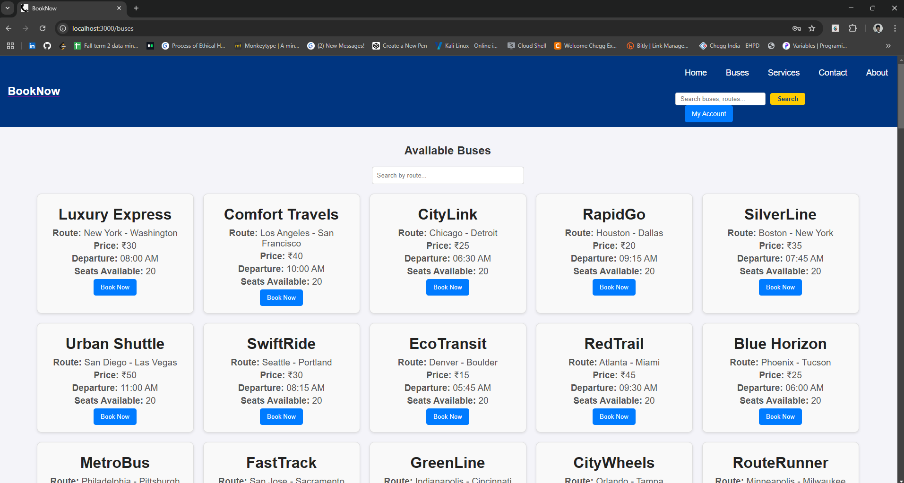
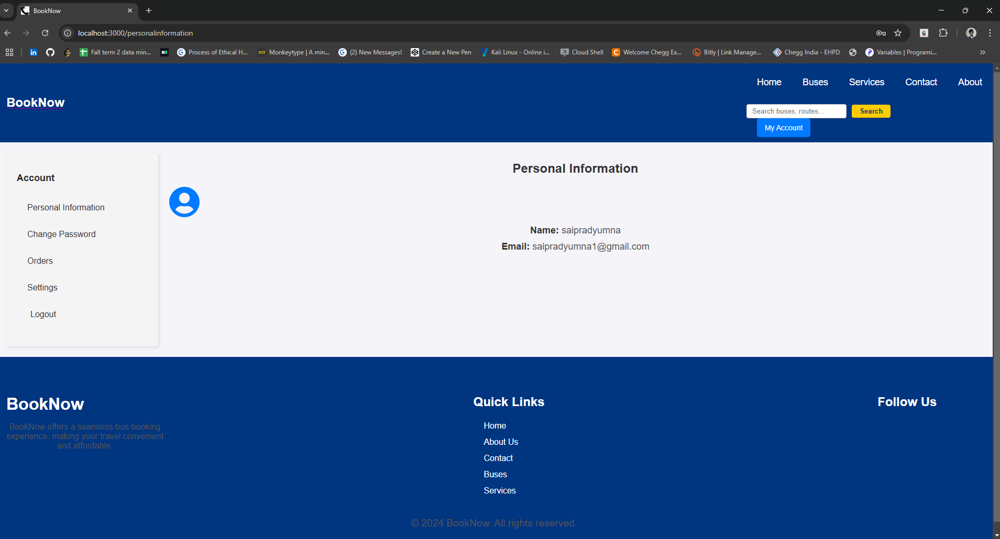

# Bus Booking Application

This project is a simple **Bus Booking Application** built with React. It allows users to select a bus, enter their details, specify the number of passengers, and confirm the booking. The total price is dynamically calculated based on the number of passengers and the bus fare per passenger.

## Features

- Displays bus details, including route, departure time, price, and available seats.
- Allows users to specify the number of passengers.
- Collects individual passenger names.
- Calculates the total fare dynamically.
- Validates user input and ensures all required fields are completed.
- Handles cases where no bus is selected gracefully.

## Installation

### Adding buses Routes

```bash
Take the buses routes from the frontend/public folder and add them to your routes in mongodb.
```


### Clone the repository:

```bash
git clone https://github.com/Saipradyumnagoud/Bus-booking-portal.git
```

### Navigate to the project directory:

```bash
cd Bus-booking-portal
```

### Navigate to the frontend:

```bash
cd frontend
```

### Install dependencies:

```bash
npm install
```

### Start the development server:

```bash
npm start
```

### Navigate to the server:

```bash
cd ../server
```

### Install dependencies:

```bash
npm install
```

### Start the backend server:

```bash
npm start
```

Open your browser and navigate to [http://localhost:3000](http://localhost:3000) to view the application.

## Usage

1. Select a bus from the main application.
2. Navigate to the booking page.
3. Enter your details, including full name, email, and phone number.
4. Specify the number of passengers.
5. Enter the names of all passengers.
6. Review the total price and confirm the booking.

## Available Busses display for booking


## My Account page which helps you to display your booking and your information


## Support

Feel free to reach out via [GitHub Issues](https://github.com/Saipradyumnagoud/Bus-booking-portal/issues) if you encounter any issues or have suggestions for improvement!
